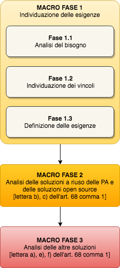

Macro fase 1: Individuazione delle esigenze
-------------------------------------------

Nella presente Macro fase, la pubblica amministrazione definisce le
esigenze (bisogni e vincoli) che condizionano le scelte per
l'individuazione di una soluzione; si suggerisce di redigere un
documento (senza alcun vincolo di forma) descrittivo delle esigenze
individuate da utilizzare nelle fasi che riguardano la comparazione e
valutazione delle soluzioni.

|image2-macro-fase-1|

.. _analisi-del-fabbisogno:

Fase 1.1: Analisi del fabbisogno
~~~~~~~~~~~~~~~~~~~~~~~~~~~~~~~~

L'amministrazione definisce il proprio fabbisogno, per l'individuazione
della soluzione software. Nel fare questo tiene conto di quanto definito
nel Programma degli acquisti e nella Programmazione dei lavori pubblici
(art. 21 del D. Lgs. n. 50 del 18/04/2016).

Le attività previste nella presente fase sono:

-  studio del contesto attraverso la descrizione delle caratteristiche
   dell'amministrazione: finalità, struttura ed organizzazione;
-  descrizione dei flussi operativi interessati dal *software* da
   acquisire, che la pubblica amministrazione mette in atto per dare
   seguito alle procedure amministrative;
-  ipotesi di ottimizzazione dei flussi in relazione al *software* da
   acquisire;
-  identificazione degli "strumenti" (definizione degli obiettivi)
   necessari alla realizzazione dei processi operativi individuati;
-  enunciazione dei requisiti, cioè dei bisogni a cui il software
   deve rispondere, prevedendo una differenziazione tra requisiti
   indispensabili e non.

La presente fase si conclude con la:

-  individuazione dei bisogni della pubblica amministrazione.

Fase 1.2: Individuazione dei vincoli
~~~~~~~~~~~~~~~~~~~~~~~~~~~~~~~~~~~~

L'amministrazione descrive i vincoli che condizionano
l'approvvigionamento della soluzione software.

Le attività previste in questa fase sono:

-  individuazione della **disponibilità di bilancio** (di seguito
   T\ :sub:`bilancio`) per assicurare la disponibilità e la messa in
   produzione della soluzione da acquisire (eventuale bonifica dati e
   migrazione da sistemi preesistenti, installazione, personalizzazione,
   integrazione con sistemi esistenti, formazione, supporto all'avvio,
   attività gestionali, pagamento di eventuali eccedenze, ecc.);
-  stima dei **tempi per la messa in esercizio** (di seguito
   T\ :sub:`tempi`) della soluzione che la Pubblica amministrazione può
   assorbire;
-  eventuali norme e linee guida che il *software* dovrà seguire nella
   propria implementazione tecnica, come per esempio:

      - `Linee Guida AgID sul Design <https://designers.italia.it/guide/>`__
        (che includono anche l'adempimento alla Legge 4/2004 sull'accessibilità);
      - Linee Guida AgID sull'Interoperabilità;
      - `Linee Guida AgiD sullo sviluppo di *software* sicuro <https://www.agid.gov.it/it/sicurezza/cert-pa/linee-guida-sviluppo-del-software-sicuro>`__.

-  eventuali altri vincoli di interesse dell'amministrazione.

La presente fase si conclude con la:

-  individuazione dei vincoli (economici e temporali) che condizionano
   le scelte dell'amministrazione.

Fase 1.3: Redazione del documento descrittivo delle esigenze
~~~~~~~~~~~~~~~~~~~~~~~~~~~~~~~~~~~~~~~~~~~~~~~~~~~~~~~~~~~~

L'amministrazione redige il documento descrittivo delle esigenze da
utilizzarsi nelle fasi successive della valutazione comparativa.

Le attività previste in questa fase sono:

-  redazione del documento descrittivo delle esigenze che contiene le
   evidenze delle precedenti fasi 1.1 e 1.2.

La presente fase si conclude con la:

-  disponibilità del documento descrittivo delle esigenze.

