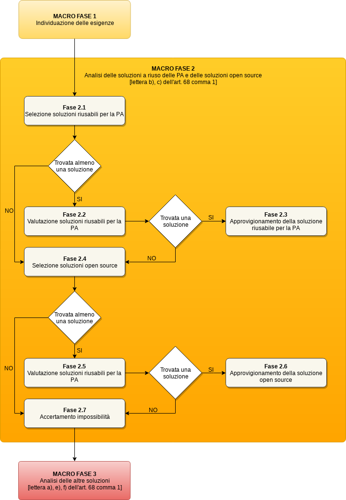

Macro fase 2: Analisi delle soluzioni a riuso delle PA e delle soluzioni Open Source
------------------------------------------------------------------------------------

La pubblica amministrazione, a partire dalla disponibilità di “soluzioni
a riuso delle PA” e “soluzioni Open Source”, DEVE verificare il
soddisfacimento delle proprie esigenze in tali soluzioni.

|image3-macro-fase-2|

Al fine di razionalizzare la spesa complessiva delle pubbliche
amministrazioni la verifica di soddisfacimento delle esigenze DEVE prima
considerare le “soluzioni a riuso delle PA” e successivamente le
“soluzioni Open Source”.

L’attuazione dell’\ `art. 69 del
CAD <http://www.normattiva.it/atto/caricaArticolo?art.progressivo=0&art.idArticolo=69&art.versione=4&art.codiceRedazionale=005G0104&art.dataPubblicazioneGazzetta=2005-05-16&atto.tipoProvvedimento=DECRETO%20LEGISLATIVO&art.idGruppo=14&art.idSottoArticolo1=10&art.idSottoArticolo=1&art.flagTipoArticolo=0#art>`__
assicura che le “soluzioni a riuso delle PA” rendano disponibile il
relativo codice sorgente, completo della documentazione, in repertorio
pubblico sotto licenza aperta.

Per approfondimenti in merito si rimanda alle `Linee Guida sul riuso del
Software <../riuso-software.html>`__.

Fase 2.1: Selezione soluzioni riusabili per la PA
~~~~~~~~~~~~~~~~~~~~~~~~~~~~~~~~~~~~~~~~~~~~~~~~~

L’amministrazione individua le “soluzioni a riuso delle PA” candidate a
soddisfare le proprie esigenze.

Le attività previste in questa fase sono:

-  ricerca delle “soluzioni a riuso delle P.P.A.A.” presenti all’interno
   della piattaforma Developers Italia, oppure tramite altri strumenti
   di ricerca e indicizzazione.

La presente fase si conclude con la:

-  individuazione delle “soluzioni a riuso delle P.P.A.A.” di interesse
   per la Pubblica amministrazione.

Fase 2.2: Valutazione soluzioni riusabili per la PA
~~~~~~~~~~~~~~~~~~~~~~~~~~~~~~~~~~~~~~~~~~~~~~~~~~~

Se la precedente fase 2.1 ha permesso di individuare almeno una delle
“soluzioni a riuso delle PA” potenzialmente di interesse per la Pubblica
amministrazione, attraverso la realizzazione della presente fase di
valutazione si provvede ad individuare la “soluzione a riuso della PA”
migliore.

Per ognuna delle “soluzioni a riuso delle PA” potenzialmente d’interesse
si provvede a:

-  verificare:

   -  la conformità alle regole sull’interoperabilità prescritte dalla
      linee guida emanate in attuazione dell’articolo 73 del CAD;
   -  la conformità alle normative sulla protezione dei dati personali;
   -  la conformità ai livelli di minimi sicurezza previsti per le
      pubbliche amministrazioni

-  calcolare il valore della soluzione attraverso i seguenti parametri
   (alcuni dei quali possono essere rinvenuti anche tramite la
   piattaforma Developers Italia):

   -  percentuale di copertura dei requisiti desiderati, funzionali e
      non funzionali, considerando la differenziazione tra
      indispensabili e non
   -  presenza di un manutentore del software in questione;
   -  eventuale presenza di accordi con terzi stipulati
      dall’amministrazione titolare e utilizzabili dall’amministrazione
      valutante, riguardo attività di supporto per l’installazione e/o
      la personalizzazione della soluzione o comunque le modalità di
      fruibilità della soluzione stessa (es: una in-house regionale può
      mettere a riuso software Open Source per i propri comuni assieme
      ad un accordo di fornitura di servizi di installazione e
      formazione);
   -  presenza di vincoli e dipendenze obbligatorie con altro software
      aperto e/o con software proprietario; per esempio, un software
      Open Source potrebbe richiedere necessariamente una licenza per un
      database proprietario, oppure potrebbe necessitare una licenza per
      una API proprietaria di un servizio *cloud*;
   -  presenza e grado di competenza delle risorse interne alla PA in
      merito alla gestione degli ambienti e dei linguaggi utilizzati
      nella soluzione;
   -  numero e tipologia di altre pubbliche amministrazioni che
      utilizzano il progetto Open Source;
   -  sostenibilità del progetto Open Source attraverso la valutazione
      di indicatori visibili sul repository Open Source, quali per
      esempio frequenza delle modifiche (*code activity*), frequenza dei
      rilasci (*release history*), comunità degli utenti (*user
      community*), longevità del progetto (*longevity*).

-  stimare il Total Cost of Ownership (S\ :sub:`TCO`) come descritto in
   `Total Cost of Ownership (TCO) <total-cost-of-ownership-tco.html>`__, con
   particolare attenzione a:

   -  eventuali costi di installazione del software nel Cloud della PA
      oppure costi per fruizione del software tramite modalità SaaS ove
      presente nel Marketplace Cloud di AgID;
   -  eventuali costi per la formazione del personale, considerando sia
      quelli necessari per l’addestramento dei soggetti destinati alla
      gestione della soluzione sia quelli per il suo utilizzo da parte
      degli utenti finali;
   -  eventuali costi necessari all’integrazione della soluzione con i
      propri sistemi;
   -  eventuali costi di personalizzazione, necessari ad assicurare la
      copertura di tutti i requisiti funzionali e non funzionali,
      indispensabili e non indispensabili;

-  stimare i tempi per la messa in produzione della soluzione (di
   seguito S\ :sub:`tempi`);
-  eventuali altri stime espressione della specificità
   dell’amministrazione.

Per dare seguito alla valutazione di quanto indicato nei precedenti
punti la pubblica amministrazione dovrà provvedere, ove non già in suo
possesso, a recuperare tutti le necessarie informazioni nelle modalità
previste dalla norma.

Tra quelle soluzioni che rientri nei i vincoli di bilancio, tempo, e
soddisfi le condizioni minime per quanto riguarda altri vincoli
specifici:

-  Il costo (TCO) rientri nei vincoli di bilancio stabiliti
   (S\ :sub:`TCO`\ < T\ :sub:`bilancio`)
-  I tempi di messa in produzione siano compatibili con i tempi stimati
   (S\ :sub:`tempi`\ < T\ :sub:`tempi`)
-  Rispetti gli altri altri vincoli ostativi

Se i vincoli sono soddisfatti, l’amministrazione individua la soluzione
più rispondente alle proprie esigenze in base alla valutazione
effettuata.

La presente fase si conclude con la:

-  determinazione della migliore “soluzione a riuso delle P.P.A.A.”, o
   eventuale non presenza si una soluzione.

Fase 2.3: Approvvigionamento della soluzione riusabile per la PA
~~~~~~~~~~~~~~~~~~~~~~~~~~~~~~~~~~~~~~~~~~~~~~~~~~~~~~~~~~~~~~~~

Ove a seguito della precedente fase 2.2 l’amministrazione abbia
determinato una “soluzione a riuso della PA” che soddisfa le sue
esigenze, provvede all'approvvigionamento. Il processo di riuso è
descritto in *3.9. Riuso di un software rilasciato sotto licenza
aperta*.

**La valutazione comparativa si considera conclusa.**

Nel caso in cui la Pubblica Amministrazione debba sostenere dei costi
durante la fase di approvvigionamento (es: personalizzazione,
installazione, formazione), la stessa acquisisce tali servizi accedendo
alla procedura indicata dal D.Lgs. 50/2016 s.m.i. (di seguito *Codice
dei contratti pubblici*).

Fase 2.4: Selezione soluzioni Open Source
~~~~~~~~~~~~~~~~~~~~~~~~~~~~~~~~~~~~~~~~~

Se non è possibile individuare una “soluzione a riuso della PA”,
l’amministrazione DEVE ampliare la ricerca delle soluzioni da
considerare per il soddisfacimento delle proprie esigenze alle
“soluzioni Open Source”, cioè software rilasciato sotto licenza aperta
ma non di titolarità di una Pubblica Amministrazione e quindi non
pubblicato a riuso.

Le attività previste nella presente fase sono:

-  ricerca di progetti di software Open Source la cui titolarità è
   attribuita a soggetti diversi dalle pubbliche amministrazioni. Tale
   ricerca può essere effettuata sia con gli strumenti messi a
   disposizione su Developers Italia, sia su altre piattaforme
   internazionali che gestiscono progetti di software Open Source.

La ricerca effettuata dalla pubblica amministrazione DEVE verificare:

-  se la licenza sotto la quale il software è distribuito è certificata
   da OSI (`lista
   completa <https://opensource.org/licenses/alphabetical>`__).

La presente fase si conclude con la:

-  individuazione delle “soluzioni Open Source” di interesse per la
   pubblica amministrazione

Fase 2.5: Valutazione soluzioni Open Source
~~~~~~~~~~~~~~~~~~~~~~~~~~~~~~~~~~~~~~~~~~~

Se la precedente fase 2.4 ha permesso di individuare almeno una delle
“soluzioni Open Source” potenzialmente di interesse, attraverso la fase
di valutazione si individua la “soluzione Open Source” migliore.

Le attività previste in questa fase sono le stesse della fase 2.2. La
scelta di una “soluzione Open Source” DEVE considerare come vantaggiosa
la circostanza che la soluzione sia già stata utilizzata da una o più
pubbliche amministrazioni.

La presente fase si conclude con la:

-  determinazione della migliore “soluzione Open Source”, o eventuale
   non presenza di una soluzione.

Fase 2.6: Approvvigionamento della soluzione Open Source
~~~~~~~~~~~~~~~~~~~~~~~~~~~~~~~~~~~~~~~~~~~~~~~~~~~~~~~~

Ove a seguito della precedente fase 2.5 l’amministrazione abbia
individuato una “soluzione Open Source” che soddisfa le sue esigenze,
procede all’acquisizione. Il processo di acquisizione è descritto in
`Riuso di un software o utilizzo di un software Open
Source <../riuso-software/riuso-di-un-software-o-utilizzo-di-un-software-open-source.html>`__.

**La valutazione comparativa si considera conclusa**.

Nel caso in cui la Pubblica Amministrazione debba sostenere dei costi
durante la fase di approvvigionamento (es: personalizzazione,
installazione, formazione), la stessa acquisisce tali servizi accedendo
alla procedura indicata dal *Codice dei contratti pubblici*.

Fase 2.7: Accertamento impossibilità
~~~~~~~~~~~~~~~~~~~~~~~~~~~~~~~~~~~~

Nel caso in cui sia accertata l'impossibilità di individuare una
soluzione che soddisfi le esigenze dell’amministrazione tra le
“soluzioni a riuso della PA” e le “soluzioni Open Source”, si procede
alla redazione di un documento (senza vincoli di forma) che motivi le
ragioni dell’accertata impossibilità.

La pubblica amministrazione prosegue la valutazione comparativa dando
seguito alle Fasi previste nella successiva Macro fase 3.

.. discourse::
   :topic_identifier: 2859
