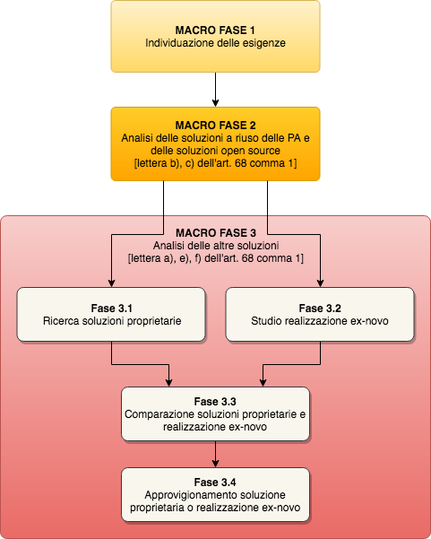

Macro fase 3: Analisi delle altre soluzioni
-------------------------------------------

La pubblica amministrazione per soddisfare le proprie esigenze DEVE
esaminare contestualmente le opportunità offerte dalle soluzioni
proprietarie e quelle di una realizzazione ex novo.

|image4-macro-fase-3|

Fase 3.1: Ricerca soluzioni proprietarie
~~~~~~~~~~~~~~~~~~~~~~~~~~~~~~~~~~~~~~~~

La pubblica amministrazione deve valutare le soluzioni proprietarie
presenti sul mercato.

L'amministrazione deve effettuare la ricerca di una soluzione con
licenza d'uso proprietaria, analizzando le offerte secondo quanto
indicato dal Codice dei contratti pubblici.

L'amministrazione deve verificare che il *software* in licenza rispetti i
seguenti vincoli (ossia, **la mancanza anche di uno solo di questi rende
la soluzione non eleggibile**):

-  conformità alle regole sull'interoperabilità prescritte dalle linee
   guida emanate in attuazione dell'articolo 73 del CAD;
-  conformità alle normative sulla protezione dei dati personali;
-  conformità ai livelli minimi di sicurezza previsti per le pubbliche
   amministrazioni;
-  la conformità ai requisiti di accessibilità (Legge 4/2004);
-  possibilità di esportare gratuitamente, in ogni momento, l'intera
   base di dati (inclusi di ogni tipo di indice o metadato utilizzato
   per implementare le funzionalità del *software* stesso) in formato
   standard, aperto e documentato, per scongiurare la possibilità di
   lock-in, come meglio specificato nelle `linee guida n.8 di ANAC
   <https://www.anticorruzione.it/portal/public/classic/Atti
   vitaAutorita/ContrattiPubblici/LineeGuida/_lineeGuida8>`__.

Tra i *software* che rispettano i vincoli appena indicati,
l'amministrazione effettua una analisi comparativa che tenga conto dei
seguenti criteri:

-  assicurare la soddisfazione dei requisiti funzionali e non
   determinati nella Macro Fase 1 con quelli indicati nella
   documentazione;
-  verificare l'idoneità della soluzione ad interoperare con i sistemi
   già in uso presso l'amministrazione;
-  eventuali costi di installazione del *software* nel Cloud della PA
   oppure costi per fruizione del *software* tramite modalità SaaS ove
   presente nel Marketplace Cloud di AgID;
-  eventuali costi necessari all'integrazione della soluzione con i
   sistemi già in uso presso l'amministrazione;
-  eventuali costi per la formazione del personale destinato alla
   gestione e amministrazione della soluzione esaminata;
-  calcolo del TCO e sua congruità rispetto alla disponibilità di
   bilancio determinata nella precedente Macro fase 1.

La presente fase si conclude con la:

-  individuazione delle soluzioni con licenza d'uso proprietaria che
   soddisfano le esigenze dell'amministrazione.

Fase 3.2: Studio realizzazione ex novo
~~~~~~~~~~~~~~~~~~~~~~~~~~~~~~~~~~~~~~

La Pubblica amministrazione, dopo aver individuato l'esistenza o meno di
una soluzione proprietaria confacente ai propri bisogni, elabora un
documento contenente un progetto di fattibilità [1]_ contenente la stima
delle attività, dei costi e dei tempi da sostenere per la realizzazione
di una soluzione ex novo che soddisfi completamente le esigenze indicate
nel documento sull'analisi dei fabbisogni così come descritto in
:ref:`analisi-del-fabbisogno`.

Fase 3.3: Comparazione soluzioni proprietarie e realizzazione ex novo
~~~~~~~~~~~~~~~~~~~~~~~~~~~~~~~~~~~~~~~~~~~~~~~~~~~~~~~~~~~~~~~~~~~~~

Nella valutazione tra lo sviluppo di una soluzione ex novo e l'acquisto
di una proprietaria (cosiddetta valutazione "make or buy"),
l'amministrazione verifica vantaggi e svantaggi di entrambe le
soluzioni, tenendo come riferimento il seguente elenco:

**Vantaggio acquisto soluzione proprietaria**:

-  rapida messa in esercizio;
-  garanzia totale e rischio applicativo a carico del fornitore;
-  manutenzione del fornitore;
-  costi di acquisto o abbonamento più bassi rispetto ad uno sviluppo
   completo;

**Vantaggio sviluppo soluzione ex novo**:

-  esaustività dei propri fabbisogni e obiettivi;
-  facilità di gestione (importazione ed esportazione) dei propri dati;
-  TCO (Total Cost of Ownership) a medio/lungo termine;
-  condivisione della soluzione e quindi ottimizzazione sui costi della
   sua tenuta in vita;
-  estensione e aggiornamento;
-  *riuso da parte di altre amministrazioni.*

**Svantaggi di una soluzione proprietaria:**

-  licenze periodiche (abbonamenti mensili, annuali) o aggiornamenti
   di versione a pagamento;
-  rigidità del flusso operativo o meglio non adattabile
   all'organizzazione operativa della Pubblica Amministrazione;
-  possibilità di lock-in, cioè costi eccessivi di cambio di soluzione
   in futuro;
-  stabilità economica del fornitore.

**Svantaggi di una soluzione sviluppata ex novo:**

-  maggiori attività da eseguire;
-  maggiore necessità di coordinamento;
-  tempi di messa in produzione maggiori.

Fase 3.4: Approvvigionamento soluzione proprietaria o realizzazione ex novo
~~~~~~~~~~~~~~~~~~~~~~~~~~~~~~~~~~~~~~~~~~~~~~~~~~~~~~~~~~~~~~~~~~~~~~~~~~~

A seguito della precedente fase 3.3 l'amministrazione ha determinato una
soluzione, con licenza proprietaria o da realizzarsi ex novo, che
soddisfa le sue esigenze e provvede all'approvvigionamento della stessa
secondo le procedure previste dal Codice dei contratti pubblici.

Nel caso in cui si opti per la realizzazione ex novo, considerando i
commi 1 e 2 dell'Articolo 69 che disciplinano la messa a riuso del
software che verrà realizzato, si rimanda a :ref:`sviluppo-nuovo-software`
per le informazioni su come progettare questa realizzazione per
adempiere ai commi citati e metterlo così a riuso.

Nel caso che si proceda ad una acquisizione di *software* proprietario
sotto licenza, si ricorda che l'Amministrazione deve ove possibile
acquisire la titolarità del codice sviluppato (come spiegato in
:ref:`titolarita`), per metterlo a riuso.

**La valutazione comparativa si considera conclusa**.

.. [1]
   `Analisi di Fattibilità per l'acquisizione delle forniture
   ICT <http://www.agid.gov.it/node/881>`__

