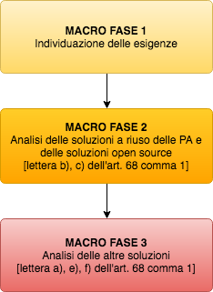

Valutazione comparativa
-----------------------

Descrizione delle soluzioni
~~~~~~~~~~~~~~~~~~~~~~~~~~~

L'articolo 68, comma 1 del CAD indica le tipologie di soluzione oggetto
dell'analisi comparativa per tipologia di software:

| "Le pubbliche amministrazioni acquisiscono programmi informatici o
  parti di essi nel rispetto dei princìpi di economicità e di
  efficienza, tutela degli investimenti, riuso e neutralità tecnologica,
  a seguito di una valutazione comparativa di tipo tecnico ed economico
  tra le seguenti soluzioni disponibili sul mercato:
|
|  a) *software* sviluppato per conto della pubblica amministrazione;
|  b) riutilizzo di *software* o parti di esso sviluppati per conto della pubblica amministrazione;
|  c) *software* libero o a codice sorgente aperto;
|  d) *software* fruibile in modalità cloud computing;
|  e) *software* di tipo proprietario mediante ricorso a licenza d'uso;
|  f) *software* combinazione delle precedenti soluzioni."

La seguente lista di definizioni descrive le sei soluzioni previste
dalla normativa:

A - *software* sviluppato per conto della pubblica amministrazione
    Soluzione detta anche "opzione *make*\ ": la PA affida lo sviluppo
    del *software* (sia esso ex novo o modifica di *software* esistente)
    a un fornitore e quest'ultimo si impegna a consegnare alla P.A. il software
    sviluppato sulla base dei requisiti da questa definiti. Per esempio,
    nel ciclo di vita del *software* (analisi, progettazione, sviluppo,
    collaudo, rilascio, manutenzione) la P.A. potrebbe occuparsi delle
    fasi di analisi e progettazione, definendo i requisiti del software,
    per poi affidare lo sviluppo al fornitore.

B - Riutilizzo di *software* o parti di esso sviluppati per conto della
    pubblica amministrazione Soluzione "riuso" di un *software* della P.A.
    (o suoi componenti) già esistente e disponibile.

C - *software* libero o a codice sorgente aperto
    *software* con licenza Open Source (vedi :ref:`glossario`). In
    particolare, si intende tutto il *software* distribuito sotto una
    licenza certificata da OSI (`lista completa <https://opensource.org/licenses/alphabetical>`__),
    come descritto in :ref:`licenze-per-il-software-aperto`.

D - *software* fruibile in modalità cloud computing
    Soluzione nella quale la P.A. acquisisce il *software* come servizio.
    In questa soluzione non sono ricomprese le soluzioni HaaS (*Hardware
    as a Service*) e IaaS (*Infrastructure as a Service*).

E - *software* di tipo proprietario mediante ricorso a licenza d'uso
    *software* soggetto a condizioni di licenza d'uso di tipo proprietario
    da installare "\ *on premise*\ ".

F - *software* combinazione delle precedenti soluzioni
    *software* realizzato con componenti appartenenti a più di una
    categoria tra quelle precedenti. Ad esempio, *software* in cui una
    soluzione in riuso si appoggia su un *middleware Open Source* e
    accede a un database proprietario, con componenti realizzate
    appositamente per conto dell'amministrazione destinataria della
    soluzione. È di fatto la tipologia più comune tra quelle
    effettivamente in uso nelle pubbliche amministrazioni.

Inoltre, il comma 1 dell'articolo 69 del CAD indica che

|  "le pubbliche amministrazioni che siano titolari di soluzioni e
  programmi informatici realizzati su specifiche indicazioni del
  committente pubblico, hanno l'obbligo di rendere disponibile il
  relativo codice sorgente, completo della documentazione e rilasciato
  in repertorio pubblico sotto licenza aperta, in uso gratuito."

Per quanto riguarda la soluzione D) (Software fruibile in modalità
*cloud computing*), questa è da considerarsi una modalità di erogazione
di servizi informatici, quindi ascrivibile di volta in volta nelle
categorie A), B), C) ed E).

Descrizione dei criteri per la valutazione
~~~~~~~~~~~~~~~~~~~~~~~~~~~~~~~~~~~~~~~~~~

Di seguito si riporta una breve descrizione dei criteri necessari per la
valutazione comparativa tra le soluzioni, per ognuno dei criteri
elencati al comma 1-bis dell'\ `art. 68 del
CAD <http://www.normattiva.it/uri-res/N2Ls?urn:nir:stato:decreto.legislativo:2005-03-07;82!vig=>`__.

Costo complessivo
    Nell'ambito del presente documento è da intendersi come *Total Cost
    of Ownership* (TCO) della soluzione, calcolato su una finestra
    temporale adeguata al contesto della valutazione, comprensivo del
    costo di migrazione verso altra soluzione (vedere anche paragrafo
    2.4).

Utilizzo di formati di dati aperti
    Uso, da parte della soluzione da valutare, di formati standard e
    aperti (v. Glossario) per la rappresentazione di dati, metadati e
    documenti, finalizzata ad assicurare l'interoperabilità tra i
    sistemi informatici delle pubbliche amministrazioni e/o dei gestori
    di pubblici servizi.

Utilizzo di interfacce aperte
    Uso, da parte della soluzione da valutare, di interfacce aperte,
    incluse *Application Programming Interface* (API), vale a dire
    interfacce pubbliche, documentate e liberamente
    implementabili/estendibili, finalizzata ad assicurare
    l'interoperabilità tra i sistemi informatici delle pubbliche
    amministrazioni e/o dei gestori di pubblici servizi.

Utilizzo di standard per l'interoperabilità
    Adeguatezza della soluzione da valutare ad assicurare
    l'interoperabilità tra i sistemi informatici delle pubbliche
    amministrazioni e/o dei gestori di pubblici servizi.

Livelli di sicurezza
    Nell'ambito del presente documento è da intendersi come l'esistenza
    di adeguate garanzie in merito ai livelli di sicurezza della
    soluzione indipendentemente dalla natura giuridica del titolare del
    *software* e/o dell'erogatore del servizio in modalità *cloud
    computing*.

Conformità alla normativa in materia di protezione dei dati personali
    È da intendersi come la conformità dei processi/procedure alla
    normativa in materia di protezione dei dati personali,
    indipendentemente dalla natura giuridica del titolare del software
    e/o dell'erogatore del servizio in modalità *cloud computing*.

Livelli di servizio del fornitore
    È da intendersi come la capacità del fornitore di erogare i servizi
    nel rispetto delle metriche precedentemente individuate dalla
    pubblica amministrazione in un *Service Level Agreement* (SLA).

Descrizione delle macro-fasi
~~~~~~~~~~~~~~~~~~~~~~~~~~~~

Vista l'eterogeneità delle soluzioni e la difficoltà ad effettuare
comparazioni quantitative omogenee, come in caso di confronto tra una
soluzione dalla quale possano essere ricavati costi certi (soluzione
proprietaria in modalità *on premise* o in modalità *cloud computing*) e
una soluzione da realizzare *ex novo* - per la quale si disponga
soltanto dello studio di fattibilità - si è preferito indicare un
processo decisionale attraverso la descrizione di Fasi e la loro
organizzazione in Macro fasi.

La seguente immagine riporta le Macro fasi che caratterizzano il
processo decisionale per dare seguito alla valutazione comparativa
prevista all'articolo 68 del CAD.

|image1-macro-fasi|

Le Macro fasi individuate sono:

MACRO FASE 1:
   Ha l'obiettivo di definire le esigenze specificando i bisogni e i
   vincoli (organizzativi ed economici) che condizionano le scelte per
   l'identificazione di una soluzione adeguata alle esigenze
   dell'amministrazione;
MACRO FASE 2:
   Qui la pubblica amministrazione accerta la possibilità
   di soddisfare le proprie esigenze utilizzando una soluzione già in
   uso presso altre amministrazioni (di seguito "soluzioni a riuso delle
   PA") o a *software* libero o codice sorgente aperto (di seguito
   "soluzioni Open Source").
MACRO FASE 3:
   Ove la Macro fase 2 non permetta di rispondere alle
   esigenze della Pubblica amministrazione, si persegue il
   soddisfacimento delle stesse attraverso il ricorso a programmi
   informatici di tipo proprietario, mediante ricorso a licenza d'uso
   e/o a realizzazioni ex novo.

In quanto segue le Macro fasi individuate sono suddivise in Fasi,
descrivendo le attività da realizzare in termini di criteri e
metodologie da adottare.

